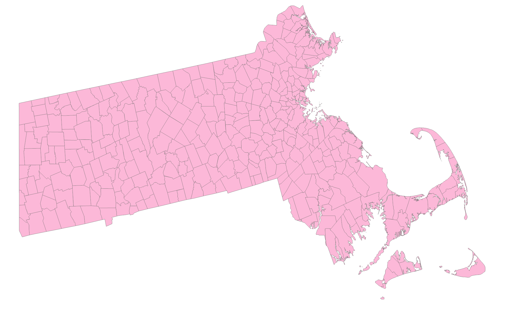
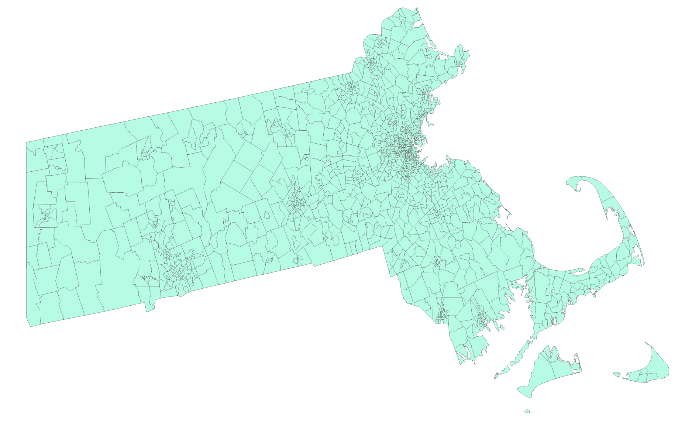
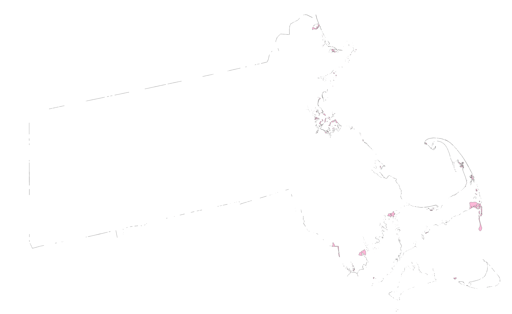
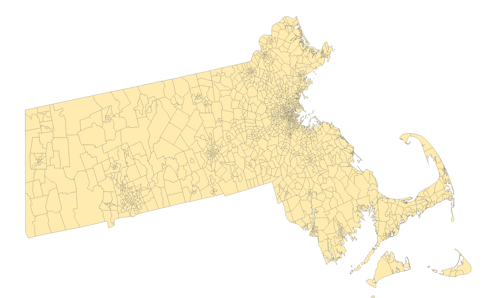

# Assignment – Geometry Processing and Method Development

- Create folder connection
- Create a sandbox.gdb and production.gdb
- Work on the sandbox so that the orginal data will be save

## Step 1 – Add Layers
Firstly, add both the **Tract** and **Townships** layers.

### Townships Layer
mass_townships_2010_aeac84

### Tracts Layer
mass_tracts_2010_aeac84

## Use clip Tool
Input:tract
Cliplayer: township
The input tract will be clipped in the shape of the township
[Clip (Analysis)—ArcGIS Pro | Documentation](https://pro.arcgis.com/en/pro-app/latest/tool-reference/analysis/clip.htm)

## Use Erase Tool
Input: Townships
Erase: Tracts
Output: mass_townships_tracts_2010_aeac84_erse1
I removed the places where tracts overlap with the townships, the edges are remained
[Erase (Analysis)—ArcGIS Pro | Documentation](https://pro.arcgis.com/en/pro-app/latest/tool-reference/analysis/erase.htm)
Remove the original layers to minimize the confusion
The erased layer has multi polygon

## Multipart to single part Tool
The erased layer is multipart, it needs to be seperated
Multipart to single part 
Input: mass_townships_tracts_2010_aeac84_erse1
Result: mass_townships_2010_aeac84_MultipartToSi

## Near
First vertices of the one polygon and first vertices of the another polygon will be i
Proximity > Near
Input: mass_townships_2010_aeac84_MultipartToSi
Near features: mass_tracts_townships_2010_aeac84_clip1
Check Location
Distance type: US Survey feet
Field Name>
Location x-coordinate: Near_X
Location y-coordinate: Near_Y
- This add the Near FID, NEAR DIST, NEAR_X, NEAR_Y fields tot he MultipartToSi layer
- It basically checks the nearest distnce of the clip layer that multipart layer

## Join
Join field
Input: mass_tracts_townships_2010_aeac84_clip1
Input: OBJECTID_1
Join table: mass_townships_2010_aeac84_MultipartToSi
Join field: NEAR_FID
Transfer fields:
Select All fields are selected expect shape_area and shape_length
- In the tracts there are lot of nulls because they are not attached to any of the township pieces

## Merge: 
Input: add two layers, the mass_tracts_townships_2010_aeac84_clip1 and mass_townships_2010_aeac84_MultipartToSi
Output: mass_tracts_townships_Merge
 - In the NEAR_FID FIELD, There are nulls for the polygons which did not have merged
 - NEAR_FID   >   Select by attributes 
    - NEAR_FID is null
- NEAR_FID  >  Calculated field
    - Select OBJECTID_1
- Because NEAR_FID AND OBJECTID_1 same this is a important step for dissolve

## Validate topology: 
to check the quality of the geometry

## Check geometry
Input: tract_merge
- Error appeared - The polygon loop around it self, we have to solve it

## Repair geometry:
Input: tract_township_merge
Check delete features with null geometry
Enable undo, for our safety if the layer get corrupted
Risk is when we try to do it, it may corrupt the layer
Check the geometry again to check if the error solved

Some techniques to try
Feature envelope to polygon 
Input: orginal township
This creates reactangle for every polygon

Minimum bounding geometry
Input: township original
Geometry type: rectangle by area
It creates huge rectangle on the top of the whole layer
It basically cover the all the polygons

## Dissolve
Input: mass_tracts_townships_Merge
Output: mass_tracts_townships_Dissolve
Dissolve Fields: NEAR_FID
Check Create a multi part feature -
Dont check unsplit - it could create slivers
Based on a common field or common identifier, it dissolves
It is a one to many relationship
We have find similar value fields, it mean
It dissolved all the middle polygons in it

## Join
Input:mass_tracts_2010_aeac84
Input field: OBJECTID_1
Join table: mass_tracts_townships_Dissolve
Join field: OBJECTID_1

It basically adds the extra data to the tracts orginal layer, which is important to out analysis

Conclusion: First, I clipped the tract to the township so that the township shape was added to the tract. This process left slivers (see the erase image). These slivers need to be merged with the clipped tract, and the geometry checked. Next, dissolve the merged file so that the joined pieces attach properly to the clipped tract. In this way, we can transfer the shape of one layer onto another layer.

