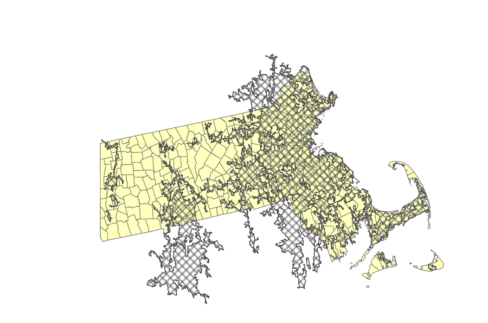
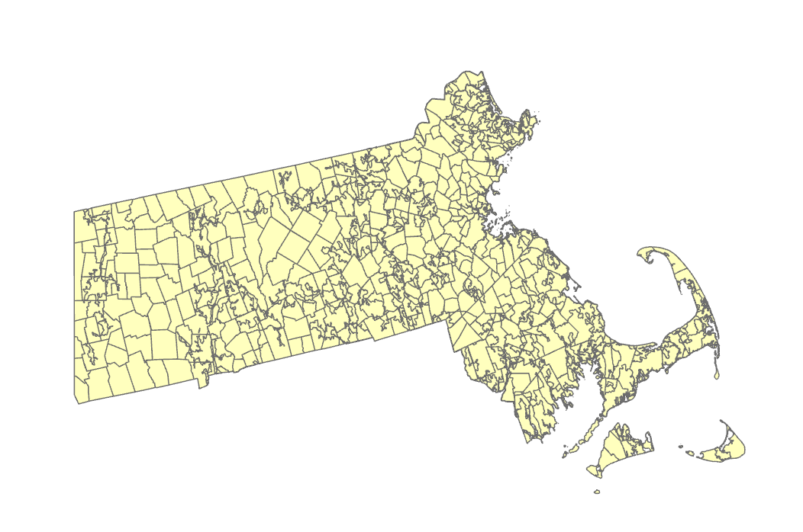
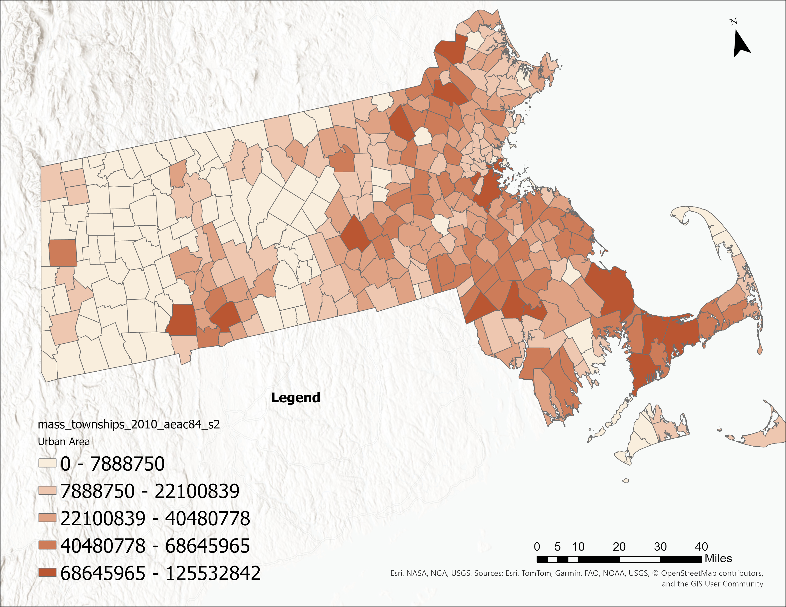
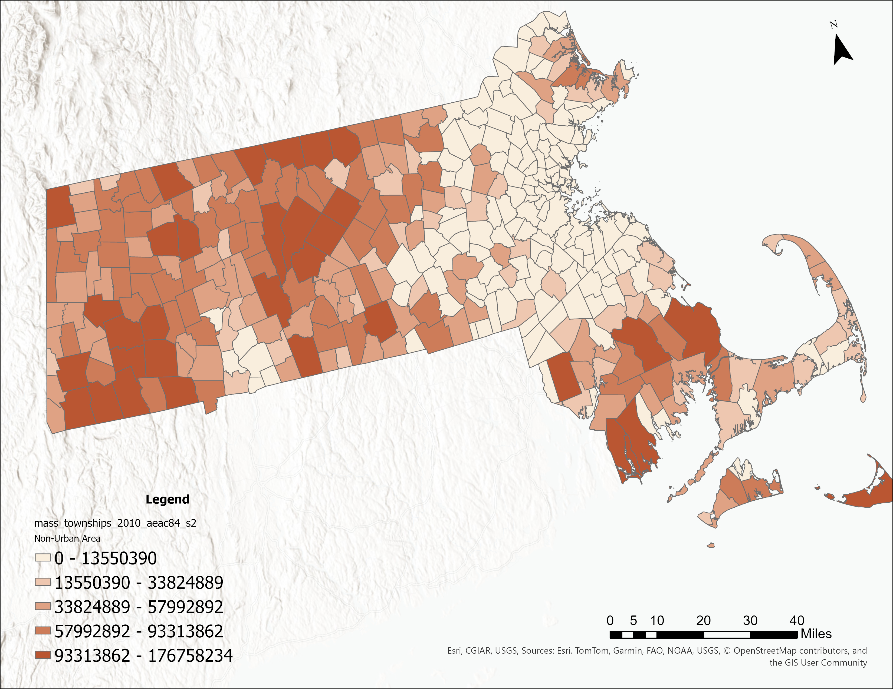
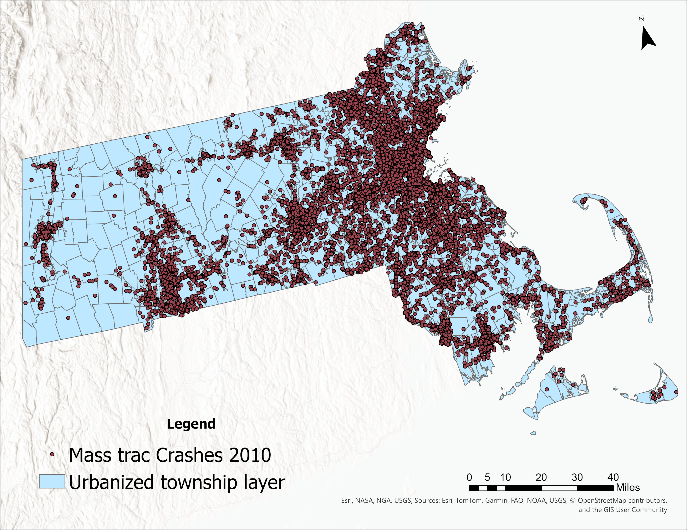

# Geoprocessing Techniques Assignment 2

In this assignment I will be working on several geo-processing techniques to prepare geographic data for analytical use. A primary objective is to think about geo-processing from a methodological perspective and plan out a systematic process, selecting the proper tools to efficiently prepare data, minimize errors, and produce a quality product for use by others. Multiple geographies will be integrated together, forming new geometries for the purpose of calculating geographic information on distinct land types, which are the urbanized and non-urbanized areas in each township.

Work will be done with 
- layer attribute tables, requiring field calculations, joins, and transfers of data between multiple attribute tables.
- Combine multiple layers into a single layer so that additional data can be obtained based on geography type, allowing for more robust and specific statistics to be calculated. 
- Additionally, these tasks also demonstrate
how to geo-process layers using geographic attributes.

## Background
A primary objective of GIS database management in many organizations is to provide geographic data for use by staff or the public. Preparing data for use by others is a laborious task that requires using a systematic process (method) that strings a series of tools (techniques) together to reduce error and standardize data. In preparing data for use by others, both the attribute and geometric data of a geography need to be cleaned and prepared before being made available for use. Not processing data to reduce error and standardizing the geographies (geometry) to make them consistent leads to incorrect analyses that can range from minimal to severe. Geo-processing is the preparation and cleaning of geographic data, including attributes with those data, There are four general stages of geographic data management, which are 
-  Data Collections, Input, & Correction, 
-  Storage & Retrieval, 
-  Manipulation & Analysis,
-  Output & Reporting (Martin, 1995). 

Geo-processing can occur in any of these stages, but data preparation and cleaning for use by others primarily occurs in
first stage. In this first stage data are collected by either creating the data or obtaining copies of data from other sources, both of which are for meeting the objectives of the
organization in using that data. These stages need not be linear in one direction, but iterative in which data are improved or extended for additional needs at any stages.

### Orginal Data used
mass_townships_2010_aeac84
Source: Massachusetts Traffic Records Analysis Center(MassTRAC)
Description: This is the township layer for Massachusetts
Number of features: 351

new_england_urbanized_areas_2010_aeac84
Source: Massachusetts Traffic Records Analysis Center(MassTRAC)
Description: This is the polygon showing the urbanized areas in the Massachusetts
Number of features: 21

## Step by Step Process
- Download the data for the assignment and save it a new folder 
- The data is in gdb(geodatabase) format, Create copy of it and rename as sandbox, It is very important to create a sandbox and production geodabase so that original data will be safe.

- In this assignment we will be working on collision data in massachusets, where initially township layer is divided to urbanized and unurbanized so that collision analysis can be done for both the areas. the following steps are done

- Overlay the township and unurbanized layers, the below figure shows how different they are
 

  
## Integrate the New England Urbanized Area layer into the Massachusetts Township layer with a spatial overlay tool.

### Identity
Purpose: It is used integrate the Urbanized Area layer (identity) into the Massachusetts Township layer (input). In terms of geo-processing, integration mean combining two different geographies (layers) into one, splitting the polygons of each geography where their geometries intersect. Doing so creates a new layer of both geographies, in which new polygons are created from splitting each where they overlap.
Input: mass_townships_2010_aeac84
Identify features: new_england_urbanized_areas_2010_aeac84
Attributes to join: All attributes ( It makes all attributes from input features as well as identity features will be transfered to the output layer )
Output layer: new_england_urbanized_areas_townships_2010_aeac84_idty
Output Description: 
- It basically cut the townships layer and added the new england urbanized layer
- Now it has both the townships polygons and urbanized polygons

- The output has the FID_new_england_urbanized_areas_2010_aeac84 
- It says whether the polygon we click isthe urbanized layer or it shows -1 if it is not linking to any of the polygon
-  -1 are the non urbanized areas and 
- Positive  values those are the urbanized areas( they are the OBJECTID_1 of the new_england_urbanized_areas_2010_aeac84 layer )

### New fields inthe new_england_urbanized_areas_townships_2010_aeac84_idty
Create two fields for identity layer, with one field being labeled AREA_URB and the other being AREA_NURB. These will hold the square kilometers for the urbanized and non-urbanized polygons, choose the type as Double as the area has decibel values

Task is to find how much area is urbanized and how is not urbanized
### Select by Attributes
For AREA_NURB
Purpose: To select the attributes of a layer with condition.
Tool: Select by Attributes
Input Rows: new_england_urbanized_areas_townships_2010_aeac84_idty
Where: FID_new_england_urbanized_areas_2010_aeac84    is equal to -1

### Calculate field
Right click on the AREA_NURB > Calculate field
Purpose: To calculate the values of a field for a feature class/feature layer or raster
Input Table: new_england_urbanized_areas_townships_2010_aeac84_idty
* Use the selected records: 309 ( it shows how many rows got selected )
* field name: AREA_NURB
* Expression: AREA_NUMB = !shape_Area!
* Output Description:
* It populated the AREA_NURB with Shape_area values

Trick to select the attributes
The -1 values of the field FID_new_england_urbanized_areas_2010_aeac84 are selected, the trick is to select **Switch** button. It selects all the values that are not -1.
- This step is useful to minimize select by attributes step.
- ALl the values that are not -1 are selected, which represents the urbanized areas

Right click on the AREA_URB > Calculate field
Purpose: To calculate the values of a field for a feature class/feature layer or raster
Input Table: new_england_urbanized_areas_townships_2010_aeac84_idty
* Use the selected records: 340 ( it shows how many rows got selected )
* field name: AREA_URB
* Expression: AREA_URB = !shape_Area!
* Output Description:
* It populated the AREA_URB with Shape_area values

- We have populated the shape areas to both AREA_NUMB and AREA_URB, it left with nulls which needs to be taken care of
- Nulls make create issue while doing any numerical analysis, they have to be changed to 0

Tool: Select by Attributes
Purpose: To select the attributes of a layer with condition.
Input Rows: new_england_urbanized_areas_townships_2010_aeac84_idty
Where: AREA_URB  **is null**
Output Description:
- It selects the rows with null values

Right click on the AREA_URB > Calculate field
Purpose: To calculate the values of a field for a feature class/feature layer or raster
Input Table: new_england_urbanized_areas_townships_2010_aeac84_idty
* Use the selected records: 309 ( it shows how many rows got selected )
* field name: AREA_URB
* Expression: AREA_URB = 0
* Output Description:
- It fills all the rows with nulls to 0 in the AREA_URB field

* Repeat the same for AREA_NURB

- Now we have create two new fields AREA_URB and AREA_NURB and filled them with the shape areas and recoded the nulls to 0.

### Summarize –i.e. aggregate by geography– the integrated township layer on the urbanized and non-urbanized area to create a table that contains one record for each township.
Purpose: To calculate the summary statistics for fields in a table
Tool: Summary Statistics
Input table: new_england_urbanized_areas_townships_2010_aeac84_idty
Ouput table: new_england_urbanized_areas_townships_2010_aeac84_idty_smry
Statistics fields:
Field, Statistic type:  
AREA_URB,   SUM
AREA_NURB,   SUM
Case field: TOWN
Output Description:
It groups all the rows with a common value and it calculated the sum of the statistic field
For both the township and urbanized layer the common field is TOWN
- Another observations, The output is not a shapefile but it is a table, so in the earlier techniques, they have input rows, input records, input field. So as per the type it requests.
- FREQUENCY: Number of polygons present in each township. The polygons will be Urbanized and Unurbanized

### Join the summarized urban/non-urban area table to the Township layer and make the join permanent. 
The summarized area table can then be linked up (attribute join) to the Township layer with the collision counts to provide a comparative context to contextualize the collision counts with the amount of area in a township that is urbanized and nonurbanize.

### Join
Right click on mass_townships_2010_aeac84 and Click Add join
Purpose: Joins a layer to another layer based on common field.
Tool: Add Join
Input field: TOWN
Join Table: new_england_urbanized_areas_townships_2010_aeac84_idty_smry
Join Field: TOWN 
Check Keep all input records ( We want all the input township layer records and additionally the summary records)
Output Description:
- This method is done so that the urbanized and Unurbanized data for each town is added and it can be exported to another new layer, we can remove the joins and keep the orginal layer safe without any edits. Instead of this, if join field is done, it works like permanent join, the orginal layer will no layer remains orginal.
  

### Exporting features
Right click on the mass_townships_2010_aeac84 and choose Export features
Purpose: To convert a feature class or feature layer to new feature class
Tool: Export Features
Input features: mass_townships_2010_aeac84
Output features: mass_townships_2010_aeac84_s2
- Other settings are mostly not used. 
Output Description:
- After exporting the township layer, I have removed all the joins. Now I have the new township layer with urbanized and unurbanized values for each town and my orginal township layer is safe with not edits.

#### Map showing the Urbanized area in Massachusetts Townships

#### Map showing the Un-Urbanized area in Massachusetts Townships

### Properly name all new fields in the updated Township layer for the two land types. That is, give the fields meaningful names so that a user can readily determine what data are in those fields.

#### Alter field
Tool: Alter field
Purpose: To rename fields and field aliases
Input: mass_townships_2010_aeac84_s2
Field name: SUM_ACERS
New field name:ACRES_SQ
Alias: ACRES_SQ

Tool: Alter field
Purpose: To rename fields and field aliases
Input: mass_townships_2010_aeac84_s2
Field name: SQUARE_ACERS
New field name:ACRES_SQM
Alias: ACRES_SQM

Tool: Alter field
Purpose: To rename fields and field aliases
Input: mass_townships_2010_aeac84_s2
Field name: FREQUENCY
New field name: CNT_AREA_PIECES
Alias: CNT_AREA_PIECES
- Connected Pieces 
Output Description:
- It changes the name of the field and arranges to the same place. In the background, it creates a new field and copies the input field data and deletes the old field NEW FIELD AREA_SQM  DOUBLE Then calculates the field and adds the old data
- SUM_ACERS is the total area of the polygon in Acers, SQUARE_ACERS is coversion of acers to miles

Alternate Method for renaming:( It only works inthe new ArcPro versions )
Click Add Field in the attribute table
Change Name and its Alias of your desired field

### Data Cleaning

In the mass_townships_2010_aeac84_s2 
There are few redundant fields they are
- objectid ( objectID is the software generated column created during joins and it is repeating )
Initially there is a objectid in the orginal township layer, it is same to the OBJECTID_1 and another objectid which is joined from the summary table (new_england_urbanized_areas_townships_2010_aeac84_idty_smry)
- Both the objectid's are removed.

Open Attribute table
- Right click on the desired field
- Delete field
Output Description:
Be careful with deletion

Usage of AI
explained what analaysis I have done and asked to check which fields can be removed in layer. belew are its suggestions
  - Duplicate identifiers
  - Geometry-related auto-fields (like Shape_Length, Shape_Area) if they’re redundant
  - Raw calculation fields used to create your summaries (e.g., area in square meters for each land parcel, intermediate ratios).
  - Temporary join fields created during the overlay/union process (like FID_1, Join_Count, etc.

## Stage III - Spatially Aggregating Geographic Data

### Summary Statistics
Purpose: To generate aggregate count of the collision type
Input: mass_trac_crashes_2010_aeac84  (point data)
Field: Mannercoll
Statistic type: Count
Case field: Mannercoll
Output: mass_trac_crashes_2010_aeac84_smry
Output description: It works like group by case field and give me the count of the each grouped field value

### Recoding of data 
Create a new field in massTract_crashes2010 layer and group the data into larger categories based on the idea of balancing the frequencies with a logical grouping of the crash types. This is called “recoding” and these new collision type categories will be used to spatially join the crash locations as general groups to the Massachusetts Township and Census Tract layers. The new MassTRAC collision categories for spatially joining to the integrated township layer should be:
a. Angle;
b. Side-swipes (Sideswipe Opposite Direction, Sideswipe Same Direction);
c. Single Vehicle (Single Vehicle, Not Collision Between two Vehicles in traffic);
d. End to End (Head On, Rear End, Rear-to-Rear);
e. Unknown (Unknown, Reported but invalid, Not Reported, Missing)

#### Add field
Add field:
Purpose: To Add a field in the attribute table
Field name: MannerColl_ctgy  
Alias: MannerColl_ctgy  
Data Type: Text 
Length: 6( Give max number you think)

#### Select by attributes
Tool: Select by attributes 
Purpose: To select all the desired rows in the columns
Input: mass_trac_crashes_2010_aeac84
Where: MannerColl   is equal   Angle
Output description: It selected all the rows inthe MannerColl which has the value angle
- In select by attributes ( For selecting single value choose “is equal” and for multiple values choose “include” )

#### Calculate field
Input: mass_trac_crashes_2010_aeac84
Check: use the selected rows: 31631
Field name: MannerCol_ctgy
Expression: MannerCol_ctgy = "ANGL"
Output description: It populates are the selected rows with ANGl text
- In calculate field while giving name choose quotes “ “  as it is a text

#### Select by attributes
Tool: Select by attributes 
Purpose: To select all the desired rows in the columns
Input: mass_trac_crashes_2010_aeac84
Where: MannerColl   Includes the value(s)   Single Vehicle, Not Collision Between two Vehicles in traffic
Output description: It selected all the rows inthe MannerColl which has the values  Single Vehicle, Not Collision Between two Vehicles in traffic

#### Calculate field
Input: mass_trac_crashes_2010_aeac84
Check: use the selected rows: 23409
Field name: MannerCol_ctgy
Expression: MannerCol_ctgy = "SVHL"
Output description: It populates are the selected rows with SVHL text

#### Select by attributes
Tool: Select by attributes 
Purpose: To select all the desired rows in the columns
Input: mass_trac_crashes_2010_aeac84
Where: MannerColl   Includes the value(s)  Sideswipe Opposite Direction, Sideswipe Same Direction
Output description: It selected all the rows inthe MannerColl which has the values Sideswipe Opposite Direction, Sideswipe Same Direction

#### Calculate field
Input: mass_trac_crashes_2010_aeac84
Check: use the selected rows: 12709
Field name: MannerCol_ctgy
Expression: MannerCol_ctgy = "SSWP"
Output description: It populates are the selected rows with SVHL text

#### Select by attributes
Tool: Select by attributes 
Purpose: To select all the desired rows in the columns
Input: mass_trac_crashes_2010_aeac84
Where: MannerColl   Includes the value(s)  Head On, Rear End, Rear-to-Rear
Output description: It selected all the rows inthe MannerColl which has the values Head On, Rear End, Rear-to-Rear

#### Calculate field
Input: mass_trac_crashes_2010_aeac84
Check: use the selected rows: 35213
Field name: MannerCol_ctgy
Expression: MannerCol_ctgy = "ETED"
Output description: It populates are the selected rows with ETED text

#### Select by attributes
Tool: Select by attributes 
Purpose: To select all the desired rows in the columns
Input: mass_trac_crashes_2010_aeac84
Where: MannerColl   Includes the value(s)  Unknown, Reported but invalid, Not Reported, Missing
Output description: It selected all the rows inthe MannerColl which has the values  Unknown, Reported but invalid, Not Reported, Missing

#### Calculate field
Input: mass_trac_crashes_2010_aeac84
Check: use the selected rows: 3636
Field name: MannerCol_ctgy
Expression: MannerCol_ctgy = "OTHR"
Output description: It populates are the selected rows with OTHR text
Now the recoding is done, A new field with clear values are added. The next step is to overlap the crashes point layer to the new england township and urbanized polygon layer.

### Assigning Collision Types to Areal Geographies
- Mask the data and make only visible the observations that are required

#### Defination query
Purpose: The locations  need to be separated so that the types are processed individually 
From the layer Table of Contents, the properties option is selected to bring up the dialog box. In it choose New defination query
Where MannerCol_ctgy   is equal to   ANGL

Once the Definition Query has been specified, the locations need to be aggregated (spatially joined). 
Aggregate the individual and collision group types with a SPATIAL JOIN from the massTRAC_crashes2010 layer to the integrated township and urbanized area layer (new_england_urbanized_areas_townships_2010_aeac84_idty)

### Spatial Join
Purpose: To join the township_and_urbanized layer to the crash points. This executes a “point-in-polygon” operation that creates a count of all the locations within each township polygon
Target features: new_england_urbanized_areas_townships_2010_aeac84_idty
Join features: massTRAC_crashes2010
Join operation: Join one to one
match option: Intersect
Output: urbanized_township_crash_sj
Output description: The result is all the ANGL filtered points are added to the polygon layer

