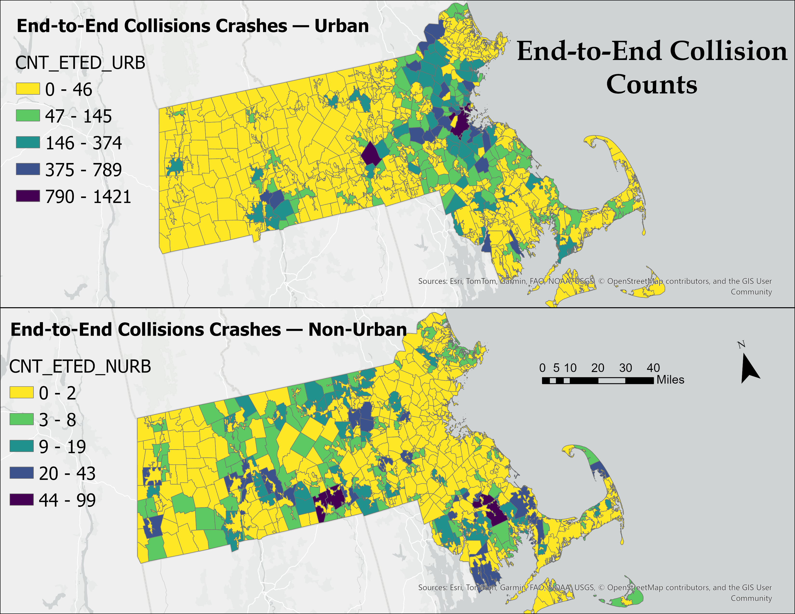

## Maps

### Urban vs. Non-Urban Areas (2010)

  

### Crash Counts by Category — Urban vs. Non-Urban
---

###  **ANGL (Angular Collisions)**  
The **ANGL** category represents **Angular Collisions** — typically **right-angle or side-impact crashes** occurring at intersections.  

- **CNT_ANGL_URB:** Number of angular collisions in **urban areas** per township.  
- **CNT_ANGL_NURB:** Number of angular collisions in **non-urban areas** per township.  

   

---

###  **ETED (End-to-End Collisions)**  
The **ETED** category represents **End-to-End Collisions** — includes **head-on**, **rear-end**, or **rear-to-rear** impacts between vehicles moving in line with each other.  

- **CNT_ETED_URB:** Number of end-to-end collisions in **urban areas** per township.  
- **CNT_ETED_NURB:** Number of end-to-end collisions in **non-urban areas** per township.  

 

---

###  **SSWP (Sideswipe Collisions)**  
The **SSWP** category represents **Sideswipe Collisions**, which occur when vehicles make **side-to-side contact** while traveling in the **same or opposite direction**.  

- **CNT_SSWP_URB:** Number of sideswipe collisions in **urban areas** per township.  
- **CNT_SSWP_NURB:** Number of sideswipe collisions in **non-urban areas** per township.  

    

---

###  **SVHL (Single Vehicle Collisions)**  
The **SVHL** category represents **Single Vehicle Collisions**, involving only **one vehicle**, often **hitting fixed objects** or **running off the road**.  

- **CNT_SVHL_URB:** Number of single-vehicle collisions in **urban areas** per township.  
- **CNT_SVHL_NURB:** Number of single-vehicle collisions in **non-urban areas** per township.  

   

---

###  **OTHR (Other / Unknown Collisions)**  
The **OTHR** category represents **Other or Unknown Collisions**, including **unclassified**, **not reported**, or **missing data** cases.  

- **CNT_OTHR_URB:** Number of other/unknown collisions in **urban areas** per township.  
- **CNT_OTHR_NURB:** Number of other/unknown collisions in **non-urban areas** per township.  

  

---

### Off-Land Collisions

  

### Densities (per km²)

   
  

### Final Integrated Overview

  

For the full workflow, see **Detailed_Procedure/STEP_BY_STEP.md**.

